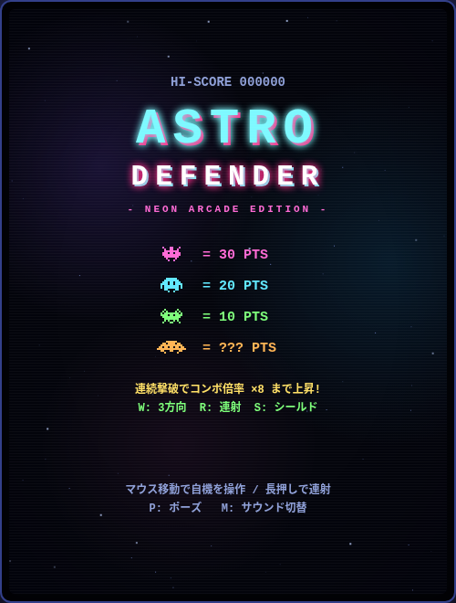
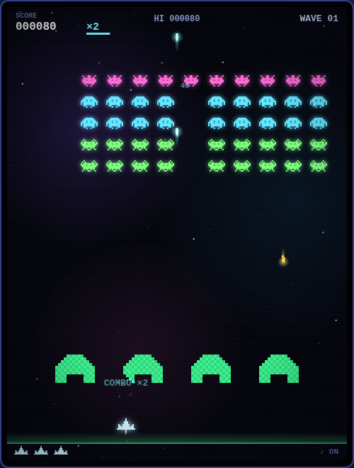

# ASTRO DEFENDER — NEON ARCADE EDITION

**▶ 今すぐプレイ: <https://hnakada123.github.io/astro-defender/>**

ブラウザだけで遊べる、マウス操作のネオレトロ風固定画面シューティングゲームです。
外部ライブラリ・外部素材は一切使わず、`index.html` 1 ファイルで完結しています。

クラシックな編隊シューティングをベースに、ネオングロー演出・コンボ倍率・
パワーアップ・シンセウェイブ風BGMを備えたモダンアーケード仕様です。

## スクリーンショット

| タイトル画面 | プレイ画面 |
| :---: | :---: |
|  |  |

## 起動方法

`index.html` をブラウザ（Chrome / Firefox / Edge など）で開くだけで遊べます。

ローカルサーバー経由で開きたい場合:

```sh
python3 -m http.server 8000
# → http://localhost:8000 を開く
```

## 操作方法

| 操作 | 内容 |
| --- | --- |
| マウス移動 | 自機の移動 |
| クリック（長押しで連射） | ショット |
| P / Esc | ポーズ |
| M | サウンド ON / OFF |
| ← → + スペース | キーボードでも操作可能 |

## ルール

- 敵の編隊を全滅させると次のウェーブへ進みます（だんだん速く・激しくなります）
- 敵に撃たれるか、敵が自機の高さまで侵攻するとミス。残機 0 でゲームオーバー
- 画面上部をときどき横切るボーナス円盤を撃つと 50〜300 点
- 緑のバリアは弾を防ぎますが、撃たれるたびに崩れていきます
- 5000 点ごとに残機が 1 つ増えます（最大 5）
- ハイスコアはブラウザの localStorage に保存されます

## モダンアーケード要素

- **コンボ倍率** — 約 2 秒以内に撃破をつなぐと倍率が上がり、最大 ×8。
  被弾または時間切れでリセット
- **パワーアップ** — 敵がまれに落とすカプセルを拾うと発動
  - `W` 3方向ショット（8秒） / `R` 連射強化（8秒） / `S` シールド（被弾1回無効）
- **パーフェクトボーナス** — ノーダメージでウェーブクリアするとボーナス得点
- **演出** — ネオングロー、弾のトレイル、パーティクル爆発、衝撃波リング、
  ヒットストップ、画面シェイク、パララックス星空と星雲
- **BGM** — Web Audio でリアルタイム生成するシンセウェイブ風ループ

## 権利について

本作は「編隊を撃ち落とす固定画面シューティング」というゲームジャンルの慣習に基づいた
オリジナル作品です。既存の商用ゲームの著作物は使用していません。

- 名称・ロゴは本作独自のもの
- 敵キャラクター等のドット絵はすべて本作のために新規にデザイン
- 効果音・BGM はすべて Web Audio API によるリアルタイム合成（既存音源の複製なし）

## ライセンス

[CC0 1.0 Universal](LICENSE)（パブリックドメイン相当）です。
クレジット表記・許諾は一切不要で、誰でも自由に使用・改変・再配布・商用利用できます。
