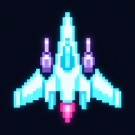
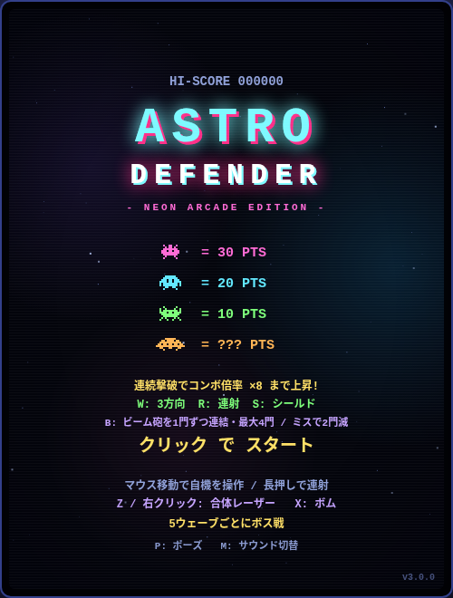
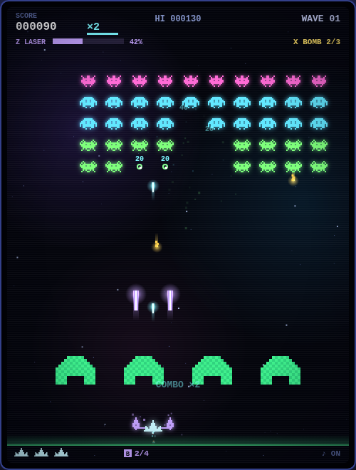

# ASTRO DEFENDER — NEON ARCADE EDITION

*[English version / 英語版はこちら](README.en.md)*

| ページ | URL |
| --- | --- |
| ▶ **今すぐプレイ** | <https://hnakada123.github.io/astro-defender/game.html> |
| 🎮 **ゲーム紹介・遊び方** | <https://hnakada123.github.io/astro-defender/> |
| 📖 **ソースコード解説**（初学者向け・全23章） | <https://hnakada123.github.io/astro-defender/doc/source.html> |
| 🌐 **Game guide (English)** | <https://hnakada123.github.io/astro-defender/doc/index.en.html> |
| 🌐 **Source code guide (English)** | <https://hnakada123.github.io/astro-defender/doc/source.en.html> |

現在のバージョン: **v3.1.0**（[更新履歴](CHANGELOG.md)）

ブラウザだけで遊べる、マウス操作のネオレトロ風固定画面シューティングゲームです。
ゲーム内の画像と音はコードから生成し、ゲーム本体は外部ライブラリなしで `game.html` 1 ファイルで動作します。

クラシックな編隊シューティングをベースに、ネオングロー演出・コンボ倍率・
パワーアップ・シンセウェイブ風BGMを備えたモダンアーケード仕様です。

表示は日本語と英語に対応しています。初回はブラウザの言語設定から自動で選ばれ、
画面下のボタンでいつでも切り替えられます（選択内容は localStorage に保存されます）。

## スクリーンショット

| タイトル画面 | プレイ画面 |
| :---: | :---: |
|  |  |

## 使用技術

- **HTML / CSS / JavaScript**（Vanilla JS。フレームワーク・外部ライブラリ・ビルドツール不使用）
- 描画: **Canvas 2D API**（ドット絵スプライトと英数字のドット文字は実行時にコードから生成）
- サウンド: **Web Audio API**（効果音・BGM をリアルタイム合成、音源ファイルなし）
- ハイスコア保存: **localStorage**

## 起動方法

[game.html](game.html) をブラウザ（Chrome / Firefox / Edge など）で開くだけで遊べます。

ローカルサーバー経由で開きたい場合:

```sh
python3 -m http.server 8000
# → http://localhost:8000/game.html を開く
```

## 操作方法

| 操作 | 内容 |
| --- | --- |
| マウス移動 | 自機の移動 |
| クリック（長押しで連射） | ショット |
| Z / 右クリック / 画面下のレーザーボタン | 合体レーザー（ゲージ満タン時） |
| X / 画面下のボムボタン | 緊急回避ボム |
| P / Esc | ポーズ |
| M | サウンド ON / OFF |
| 画面下の 日本語 / ENGLISH | 表示言語の切り替え |
| ← → + スペース | キーボードでも操作可能 |

## ルール

- 敵の編隊を全滅させると、そのまま次のウェーブへ進みます
- 5ウェーブごとに大型戦艦が登場。左右の砲台を壊し、中央のコアを撃破するとクリア
- 敵弾や突入する敵に当たるとミス。残機 0、または敵の編隊が地上まで侵攻するとゲームオーバー
- 画面上部をときどき横切るボーナス円盤を撃つと 50〜300 点
- 緑のバリアは敵弾を防ぎ、撃たれるたびに崩れていきます。自機の弾はバリアを素通りします
- 10000 点で残機が 1 つ増え、以降は 20000 点ごとに増えます（最大 5）
- ハイスコアはブラウザの localStorage に保存されます

## モダンアーケード要素

- **コンボ倍率** — 約 2 秒以内に撃破をつなぐと倍率が上がり、最大 ×8。
  上の段ほど多くつなぐ必要があり、×2 は 3 体、×3 は 7 体、×8 は 42 体の連続撃破で到達します。
  被弾・時間切れ・次のウェーブへの移動でリセット
- **パワーアップ** — 敵がまれに落とすカプセルを拾うと発動
  - `W` 3方向ショット（8秒） / `R` 連射強化（8秒） / `S` シールド（被弾1回無効）
  - `B` ビーム砲連結 — 取得するたびに自機の左右へ交互に1門ずつ追加（最大4門）。
    通常ショットと同時にビームを発射し、`W`・`R`・`S` と併用できます。
    ビームは1門につき画面内1発までで、前の弾が消えるまでその砲は次を撃ちません。
    時間制限はなく次のウェーブにも持ち越せますが、ミスすると2門減ります
    （シールドで防いだ場合は維持）。画面下部に連結数を表示します
  - シールド中の `S`、4門そろった後の `B` は、効果の代わりに500点になります
- **パーフェクトボーナス** — ノーダメージでウェーブクリアするとボーナス得点
- **演出** — ネオングロー、弾のトレイル、パーティクル爆発、衝撃波リング、
  ヒットストップ、画面シェイク、パララックス星空と星雲
- **BGM** — Web Audio でリアルタイム生成するシンセウェイブ風ループ

## 新しい戦闘システム

- **合体レーザー** — 敵の撃破やボスへの通常攻撃でゲージを充電し、満タンで1.2秒間の
  貫通レーザーを発射。射線上の敵・敵弾を一掃し、バリアは傷つけません。
  連結ビーム砲が多いほど太く強力になり、連結砲がなくても使用できます。
  照射中は反動で自機がゆっくりとしか動けません（毎秒70px）。
  発射しても連結砲は失われません。レーザーによる撃破では再充電しません
- **大型戦艦とのボス戦** — 左右の砲台が中央コアを保護しています。
  砲台からの拡散弾に加え、赤い範囲で1.1秒前に着弾位置を予告するレーザーを使用。
  予告位置は固定されるので、赤い範囲から離れて回避できます。予告と発射の間、ボスはその場で停止します。
  ボス戦では画面内に撃てる通常弾が3発から5発に増えます。撃破でボムを1個補給。
  ボスは登場するたびにレベルが上がります（ウェーブ5が Lv.1、10が Lv.2 …）
  - Lv.2: 1回おきに、自機の左右を2本のレーザーで挟み撃ち。動かなければ間に収まります
  - Lv.3: 発射と同時に船体の中央から、自機を狙う扇状の5発
  - Lv.4以降: 攻撃の間隔が短くなります（Lv.6まで）。耐久力は Lv.4 で頭打ちです
- **突入する敵** — ウェーブ2から、予告後に急降下・ジグザグ・横からの突入を行う敵が出現。
  撃ち逃した敵は編隊に戻り、撃破するまでウェーブは続きます
- **後半の新しい攻撃** — ウェーブ6から自機を狙う赤い弾が混ざり、ウェーブ11から突入する敵が
  降下中に1発撃ち、ウェーブ16から編隊が3方向弾をまとめて撃ちます。
  敵の発射間隔と画面内の敵弾の上限は30ウェーブ前後まで上がり続けます（編隊の基本速度はウェーブ13で頭打ち）。
  新しい攻撃が始まる前のウェーブクリア画面で、次に来るものを予告します
- **緊急回避ボム** — 初期2個、最大3個。画面全体の敵弾を消し、自機から240px以内の敵を撃破。
  ボスの各部位にもダメージを与え、ボスの予告・発射中のレーザーを中断します。
  使用後1.6秒間は無敵。バリアは傷つけず、ミスでは補充されません

## ソースコード解説

`game.html` の中身を初学者向けに 23 項目で読み解く解説ページを用意しています。
日本語版は4つの分野に分けた項目一覧から、各項目の詳細ページへ移動できます。英語版は全23章を1ページにまとめています。
ゲームループ・状態遷移・スプライト生成・当たり判定・Web Audio による音の合成などを、
実ソースの行番号つき抜粋、確認課題、ブラウザ上で触れる実験コーナーで説明しています。

- 日本語: <https://hnakada123.github.io/astro-defender/doc/source.html>（[doc/source.html](doc/source.html)）
- English: <https://hnakada123.github.io/astro-defender/doc/source.en.html>（[doc/source.en.html](doc/source.en.html)）

## ファイル構成

| パス | 内容 |
| --- | --- |
| `game.html` | ゲーム本体（HTML・CSS・JavaScript を1ファイルにまとめたもの）。`?lang=en` / `?lang=ja` を付けると、その言語で開く |
| `game.en.html` | 英語で共有するための入口。英語のカード画像を出し、開くとすぐ英語表示のゲームへ移る |
| `index.html` | ゲーム紹介・遊び方のページ（公開サイトのトップ。`doc/index.html` も同じ内容） |
| `doc/` | 英語のゲーム紹介（`index.en.html`）、ソースコード解説（`source.html`・`guide/`・`source.en.html`）、共通の CSS・JavaScript・画像 |
| `favicon.ico`・`assets/icons/` | ブラウザ用のアイコン |
| `assets/fonts/` | 紹介ページと解説ページのラベルに使う Silkscreen フォント |
| `assets/social/` | X などで紹介ページを共有したときに出るカード画像（作り直し方は `generation.txt`） |
| `screenshots/` | この README のスクリーンショット |
| `promo/` | 紹介動画（v1.0.0、日本語・英語） |
| `tests/` | ゲームロジックのテスト |

紹介ページと解説ページの CSS・JavaScript を変えたときは、各ページで読み込みに付けている `?v=20261009-4` の番号も上げます。
ブラウザに残った古いファイルが、新しいページと組み合わさって使われるのを防ぐためです。

## 開発用テスト

Node.js の組み込みテスト機能で、連結砲・必殺技・ボス・突入する敵・後半の敵の攻撃・コンボと残機・入力・
ドット文字・パーティクルの上限、ミスやウェーブ遷移時の動作を確認できます（追加パッケージ不要）。

```sh
node --test tests/*.test.cjs
```

## バージョン

[セマンティック バージョニング](https://semver.org/lang/ja/)に従い、リリースを `vX.Y.Z` の git タグで記録します。
現在は **v3.1.0** です。タイトル画面の右下にも表示され、変更内容は [CHANGELOG.md](CHANGELOG.md) にまとめています。

- X（メジャー）: 操作やルールが変わるなど、遊び方の互換性に影響する変更
- Y（マイナー）: 新しい機能・敵・演出の追加
- Z（パッチ）: 不具合修正や数値の微調整

バージョンを上げるときは、`game.html` 冒頭の `VERSION` 定数、この README、`CHANGELOG.md` を更新し、
`git tag vX.Y.Z` を打って `git push --tags` します。

## 権利について

本作は「編隊を撃ち落とす固定画面シューティング」というゲームジャンルの慣習に基づいた
オリジナル作品です。既存の商用ゲームの著作物は使用していません。

- 名称・ロゴは本作独自のもの
- 敵キャラクター等のドット絵と、画面の英数字に使うドット文字はすべて本作のために新規にデザイン
- 効果音・BGM はすべて Web Audio API によるリアルタイム合成（既存音源の複製なし）

## ライセンス

[CC0 1.0 Universal](LICENSE)（パブリックドメイン相当）です。
クレジット表記・許諾は一切不要で、誰でも自由に使用・改変・再配布・商用利用できます。

ただし、紹介ページと解説ページのラベルに使っている Silkscreen フォント（[assets/fonts/](assets/fonts/)）は
The Silkscreen Project Authors の著作物で、[SIL Open Font License 1.1](assets/fonts/OFL.txt) で配布されています。
このフォントは CC0 の対象外です。ゲーム本体（`game.html`）では使っていません。
